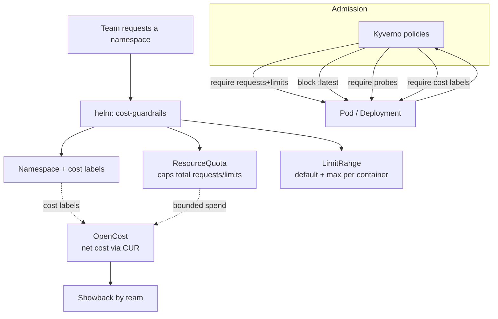

# EKS Cost &amp; Governance Toolkit

A sanitized, opinionated starter for running **cost-aware, well-governed workloads on Amazon
EKS**. It combines policy-as-code guardrails, per-team namespace budgets, and rightsizing
patterns so multi-tenant clusters stay both **safe** and **attributable**.

> **Sanitized reference.** Team names, cost centers, and limits here are examples
> (`payments`, `cc-1001`). This is a *pattern library* to adapt, not a drop-in for any specific
> cluster.

## Three pillars

| Pillar | What it enforces | Where |
|---|---|---|
| **Governance** | Policy-as-code: resource requests/limits required, no `:latest`, probes required, cost labels required | [`policies/kyverno/`](policies/kyverno/) |
| **Cost** | Per-namespace `ResourceQuota` + `LimitRange`, cost-allocation labels for showback | [`base/`](base/), [`helm/cost-guardrails/`](helm/cost-guardrails/) |
| **Measurement** | OpenCost allocates real (CUR-based, net) spend by team/namespace | [`cost-tracking/`](cost-tracking/) |
| **Guardrails** | A Helm chart that templatizes a governed, budgeted team namespace | [`helm/cost-guardrails/`](helm/cost-guardrails/) |

## How it fits together



- **Namespace guardrails** (Helm) give every team a budgeted, labelled home.
- **Kyverno policies** (admission) stop the workloads that drive silent waste — unbounded pods,
  mutable `:latest` images, missing probes, unlabelled (un-attributable) resources.
- **OpenCost** (in [`cost-tracking/`](cost-tracking/)) reads those labels and allocates real,
  CUR-based spend so Kubernetes cost maps back to the same `team` / `cost-center` keys used in
  the AWS billing analytics.

## Repository layout

| Path | Contents |
|---|---|
| `policies/kyverno/` | Kyverno `ClusterPolicy` guardrails (governance) |
| `base/` | A plain-manifest governed team namespace (quota + limits + default-deny network) |
| `helm/cost-guardrails/` | Helm chart that renders a governed team namespace from values |
| `cost-tracking/` | OpenCost integration (CUR-based net pricing) + `/allocation` query scripts |
| `docs/` | Namespace model, policy catalog, rightsizing, cost tracking |
| `examples/` | Sample per-team Helm values |

## Quickstart

Render a governed namespace for a team:

```sh
helm template payments ./helm/cost-guardrails -f examples/payments-team-values.yaml
```

Apply the Kyverno guardrails (requires Kyverno installed in the cluster):

```sh
kubectl apply -f policies/kyverno/
```

Track real spend with OpenCost (CUR-based net pricing) — see
[`docs/cost-tracking.md`](docs/cost-tracking.md):

```sh
helm install opencost opencost/opencost -n opencost -f cost-tracking/opencost/values.yaml
```

## Why this matters

On multi-tenant EKS, cost and risk both come from the *absence* of defaults: pods with no
limits, images on `:latest`, workloads no one owns. This toolkit encodes the boring, correct
defaults as policy and templates so the cluster is cost-attributable and governed by
construction — the same "make the safe path the easy path" principle applied to Kubernetes.

See the companion **aws-finops-analytics-pack** for the AWS-side cost analytics that consumes
the same `team` / `cost-center` attribution keys.

## License

[MIT](LICENSE) © Pradeep Maddi
