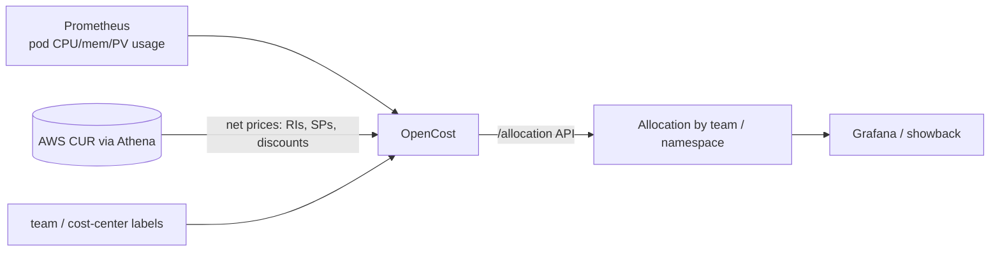

# Cost tracking with OpenCost

This is the **measurement** layer. The guardrails make workloads attributable; OpenCost turns
that attribution into dollars — allocated by the same `team` / `cost-center` / `environment`
labels the `require-cost-labels` policy enforces.

[OpenCost](https://www.opencost.io/) is the CNCF open-source cost model (Kubecost is the
commercial product built on it). It reads pod-level resource usage from Prometheus and joins it
to cloud prices to allocate spend per namespace, controller, or label.

## Flow



## Pricing modes

| Mode | Source | Accuracy |
|---|---|---|
| **Public** (default) | AWS public On-Demand pricing API | Good for relative/trend; ignores your discounts |
| **CUR / Athena** (configured here) | Your Cost and Usage Report queried via Athena | **Net** cost — reflects RIs, Savings Plans, and negotiated rates |

This blueprint configures the **CUR/Athena** mode so Kubernetes allocation matches the real
invoice — the same CUR the companion **aws-finops-analytics-pack** analyzes.

## Prerequisites

- A Prometheus (or Amazon Managed Prometheus) scraping the cluster.
- A CUR delivered to S3 with an Athena table (see `aws-finops-analytics-pack`).
- An IAM role for OpenCost to read the CUR, assumed via IRSA. Minimum permissions:
  - `athena:StartQueryExecution`, `athena:GetQueryExecution`, `athena:GetQueryResults`
  - `glue:GetTable`, `glue:GetPartitions`, `glue:GetDatabase`
  - `s3:GetObject`, `s3:ListBucket` on the CUR bucket and the Athena results bucket

## Install

1. Create the cloud-integration secret from [`../cost-tracking/opencost/cloud-integration.json`](../cost-tracking/opencost/cloud-integration.json)
   (edit the placeholders first):

   ```sh
   kubectl create namespace opencost
   kubectl -n opencost create secret generic cloud-integration \
     --from-file=cloud-integration.json=cost-tracking/opencost/cloud-integration.json
   ```

2. Apply the IRSA service account
   ([`../cost-tracking/opencost/manifests/serviceaccount.yaml`](../cost-tracking/opencost/manifests/serviceaccount.yaml)).

3. Install the chart with the provided values:

   ```sh
   helm repo add opencost https://opencost.github.io/opencost-helm-chart
   helm install opencost opencost/opencost \
     -n opencost -f cost-tracking/opencost/values.yaml
   ```

## Reading allocations

Port-forward and query the `/allocation` API (see [`../cost-tracking/queries/`](../cost-tracking/queries/)):

```sh
kubectl -n opencost port-forward svc/opencost 9003:9003 &
OPENCOST_URL=http://localhost:9003 ./cost-tracking/queries/allocation-by-team.sh
```

## Why net cost matters

Allocating on public On-Demand pricing over-states spend for any team running on Reserved
Instances, Savings Plans, or Graviton. Wiring OpenCost to the CUR means the number a team sees in
Kubernetes showback reconciles with the number Finance sees on the invoice — one source of truth.
